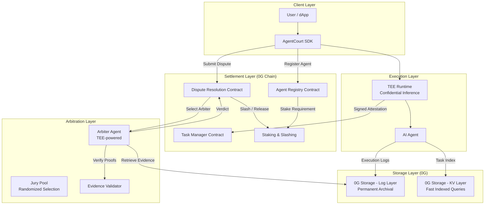

# AgentCourt Architecture

## System Overview

AgentCourt is a decentralized arbitration platform for AI agent disputes, built on 0G infrastructure.

## Component Responsibilities

### Client Layer
- **SDK**: TypeScript library providing high-level APIs for agent registration, task submission, dispute filing, and evidence retrieval.

### Execution Layer
- **TEE Runtime**: Intel SGX / AMD SEV enclave that runs agent inference. Produces signed attestations proving correct execution.
- **AI Agent**: The model or tool-use agent performing the requested task inside the TEE.

### Storage Layer
- **Log Layer**: Immutable append-only storage for full execution transcripts. Referenced by Merkle root hash.
- **KV Layer**: Key-value index for fast lookups (task metadata, agent profiles, dispute status).

### Settlement Layer
- **Agent Registry**: On-chain registry mapping agent IDs to owners, stakes, and TEE public keys.
- **Task Manager**: Manages task lifecycle (created, executing, completed, disputed).
- **Dispute Resolution**: Accepts dispute submissions, coordinates arbitration, enforces verdicts.
- **Staking & Slashing**: Economic security — agents stake tokens; malicious behavior is penalized.

### Arbitration Layer
- **Arbiter Agent**: Automated dispute analyzer running in its own TEE. Examines evidence and produces signed verdicts.
- **Jury Pool**: For high-value disputes, a randomized jury of staked arbiters reaches consensus.
- **Evidence Validator**: Verifies TEE attestations, storage proofs, and proof bundle integrity.

## Security Model

1. **Execution Integrity**: TEE attestation proves the agent ran unmodified code on unmodified inputs.
2. **Storage Integrity**: 0G Merkle roots ensure stored data has not been tampered with post-execution.
3. **Economic Security**: Staking creates financial incentives for honest behavior; slashing penalizes violations.
4. **Dispute Finality**: Arbiter verdicts are signed in TEE and submitted on-chain, creating an auditable trail.
