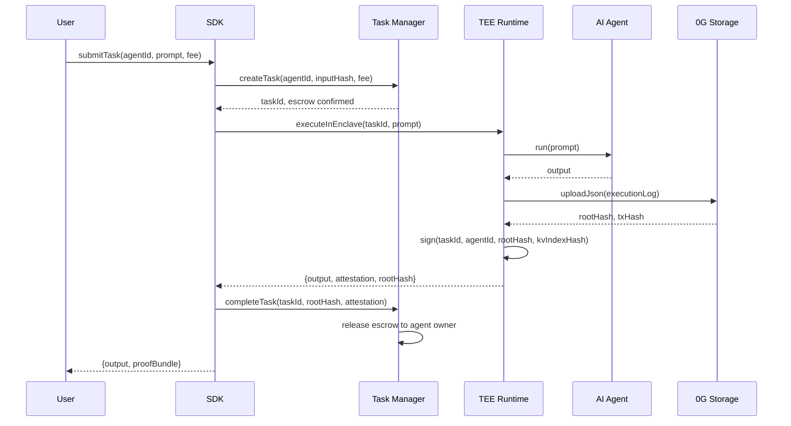
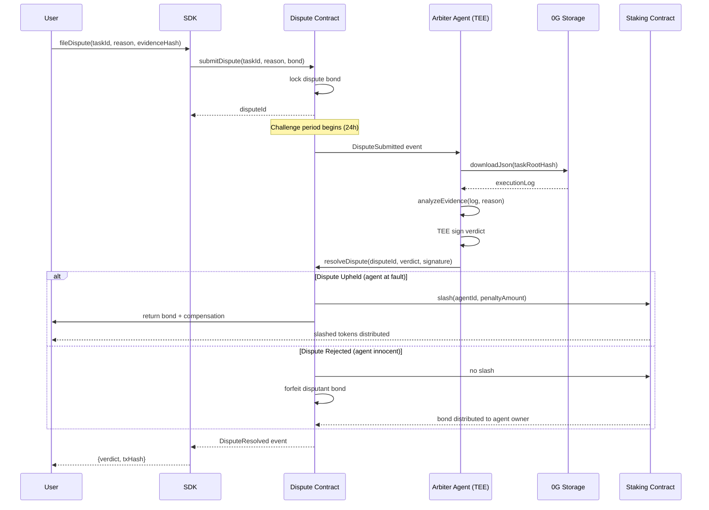
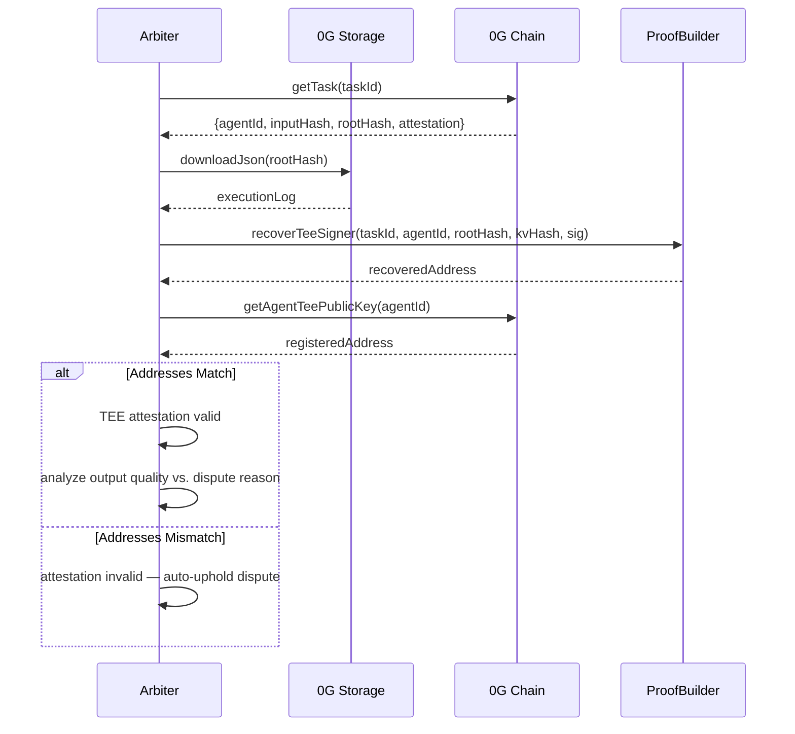

# AgentCourt Data Flow

## Normal Task Execution

The happy-path flow for a task submitted through AgentCourt:

## Dispute Resolution Flow

When a user disputes a task result:

## Evidence Verification Sub-flow

How the arbiter verifies evidence integrity before rendering a verdict:

## Key Design Decisions

1. **Asynchronous Arbitration**: Disputes are resolved asynchronously via events, allowing arbiters to process at their own pace within the challenge window.
2. **Bond Mechanism**: Both parties have skin in the game — agents stake at registration, disputants post a bond. This discourages frivolous disputes.
3. **TEE-in-TEE**: The arbiter itself runs in a TEE, ensuring the verdict logic cannot be tampered with or front-run.
4. **Storage as Source of Truth**: All execution logs are stored on 0G before task completion. This guarantees evidence availability during disputes.
